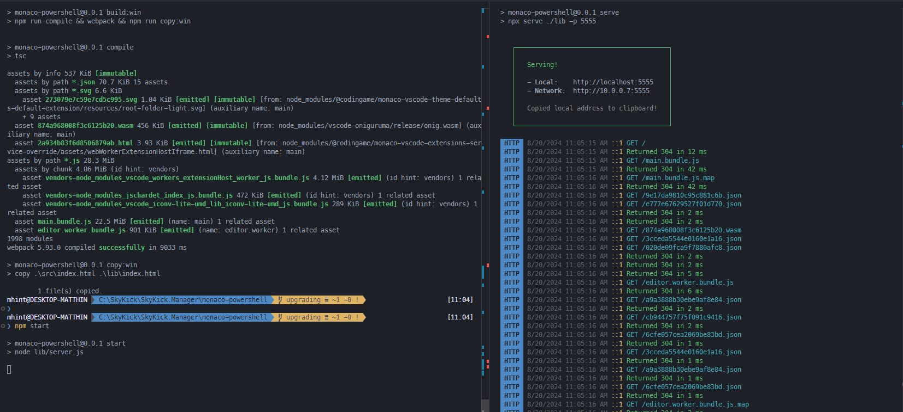
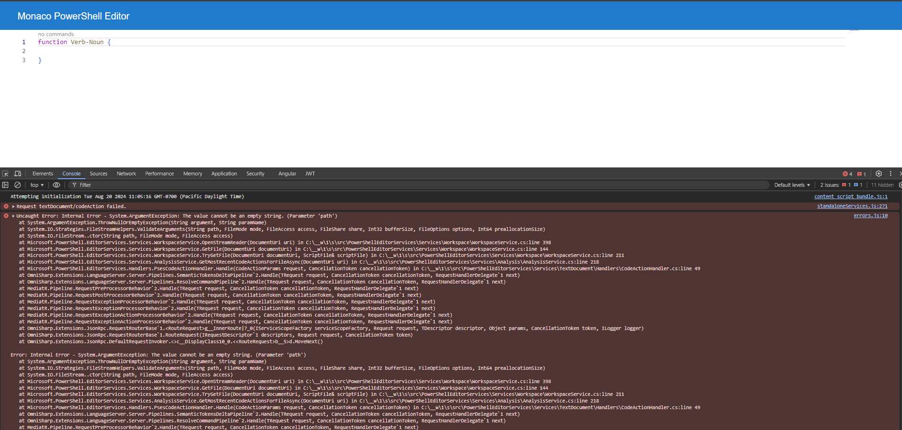

# Monaco PowerShell Editor vNext

## Running PSES locally

> I am developing on Windows, so this shows the issue in Windows. To run the server in unix, use Dockerfile setup below.

1. Change `package.json` `"prepare"` statement to `npm run clean && npm run build:win` if building with Windows instead instead of unix.
2. Run `./build.ps1`
3. To run locally, run `npm start` to start the server on port 4000
4. Open another terminal and run `npm run serve` to start the client on port 5555

## Running PSES in Docker (unix)

1. I'm running Windows locally, so to show this also happens test this in unix systems, I've created a Dockerfile to build the project in a unix environment.
2. Run `docker build -t pses .` to build the image
3. Run `docker run -it -p 4000:4000 pses` to start the server

## Error

In both cases I get errors when performing `textDocument/codeAction` and `codeLens/resolve` commands.:

